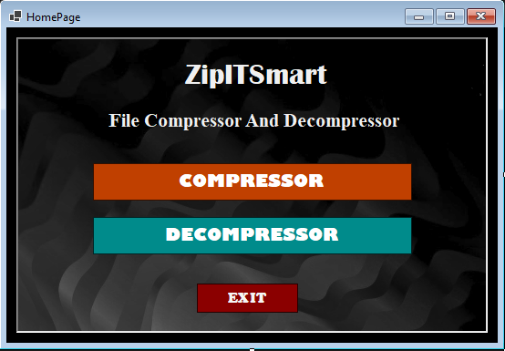
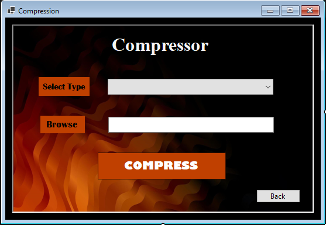
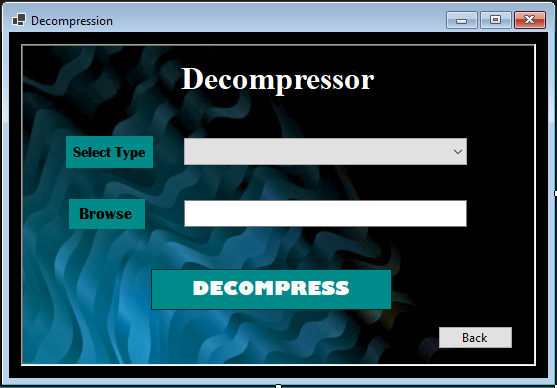

# ZipITSmart 🗂️💨

[](LICENSE)
[](https://docs.microsoft.com/en-us/dotnet/csharp/)
[](https://dotnet.microsoft.com/)

**ZipITSmart** is a Windows Forms application built in **C# (.NET 10)** that allows users to **compress and decompress files, images, and folders** using **Huffman coding** for efficient storage.  

It provides a simple UI for selecting files/folders and automatically handles compressed `.huf` archives.

---

## Team 👥

| Name | Role | GitHub |
|------|------|--------|
| Muhammad Hammad Asher | Team Lead / Developer | [Hammad](https://github.com/hammadAsher100) |
| Muhammad Affan bin Aamir | Developer / Designer | [Affan](https://github.com/Afffan16) |
| Samiullah Baig | Developer | [Samiullah](https://github.com/Samiullahbaig661) |
| Syed Shayan Agha | Designer / Developer / Documentation | [Shayan](https://github.com/ShayanAgha) |

---

## Features ✨

- Compress **Files** (`.txt`, `.doc`, `.docx`, `.ppt`, `.pptx`, `.pdf`)  
- Compress **Images** (`.jpg`, `.png`, `.bmp`, `.gif`, `.tiff`)  
- Compress **Folders** (all files inside are compressed individually)  
- Decompress any `.huf` compressed file  
- Shows **original size**, **compressed size**, and **compression ratio**  
- Safe and **binary-friendly** compression using Huffman coding  

---

## Screenshots 🖼️

  
*Home page with Compression/Decompression options.*

  
*Compression page with File/Image/Folder options.*

  
*Decompression page with folder/file selection.*

---

## How It Works ⚙️

1. **Compression:**
    - Choose the type: File, Image, or Folder.  
    - Select input file/folder.  
    - Select output filename/location.  
    - Click **Compress**.  

2. **Decompression:**
    - Select the `.huf` compressed file.  
    - Choose output folder or filename.  
    - Click **Decompress**.  

The **dispatcher** automatically detects the type (`F`=File, `I`=Image, `D`=Folder) to correctly decompress.

---

## Repository Structure 📁

```

ZipITSmart/
│
├── ZIPITSmart/
│   │
│   ├── Core/
│   │   ├── Huffman/
│   │   │   ├── HuffmanNode.cs
│   │   │   ├── HuffmanTree.cs
│   │   │   └── HuffmanService.cs
│   │   ├── Interfaces/
│   │   │   ├── ICompressor.cs
│   │   │   └── IDecompressor.cs
│   │   └── Archive/
│   │       ├── ArchiveHeader.cs
│   │       ├── ArchiveReader.cs
│   │       └── ArchiveType.cs
│   │
│   ├── Services/
│   │   ├── CompressionDispatcher.cs
│   │   ├── FileCompressionDecompressionService.cs
│   │   ├── ImageCompressionDecompressionService.cs
│   │   └── FolderCompressionDecompressionService.cs
│   │
│   ├── Models/
│   │   ├── FileMetaData.cs
│   │   └── CompressionResult.cs
│   │
│   ├── UI/
│   │   ├── HomePage.cs
│   │   ├── CompressionPage.cs
│   │   └── DecompressionPage.cs
│   │
│   └── Program.cs
│
├── ZipITSmart.sln
│
├── Images/
│   ├── HomePage-UI.png
│   ├── Compressor-UI.png
│   └── Decompressor-UI.png
│
├── Documentations/
│   ├── Project-Proposal.pdf
│   └── Project-Report.pdf
│
├── .gitignore
│
├── LICENSE
│
└── README.md

````
---

## Installation 💻

You can get and run **ZipITSmart** in two ways:

### 1. Using the GitHub Repository

1. Clone the repository:

```bash
git clone https://github.com/Samiullahbaig661/ZipIt-Smart
````

2. Open in **Visual Studio 2022** or higher.
3. Build the solution (`Ctrl+Shift+B`).
4. Run `program.cs`.

### 2. Using the Precompiled Release

1. Go to the [Releases](https://github.com/Samiullahbaig661/ZipIt-Smart/releases) page on GitHub.
2. Download the latest **Release ZIP**.
3. Extract the ZIP file to a folder of your choice.
4. Run the `ZipITSmart.exe` file inside the folder. The project will launch directly.

---

## Usage 📝

**Example: Compressing a Folder**

1. Select `Folder` from the dropdown.
2. Browse and select your folder.
3. Choose the output `.huf` file location.
4. Click **Compress**.
5. Check compression stats in the popup.

**Example: Decompressing a File**

1. Browse and select a `.huf` file.
2. Choose output folder (or file for single files/images).
3. Click **Decompress**.

---

## Supported Formats 📦

| Type   | Supported Extensions                 |
| ------ | ------------------------------------ |
| File   | .txt, .doc, .docx, .ppt, .pptx, .pdf |
| Image  | .jpg, .jpeg, .png, .bmp, .gif, .tiff |
| Folder | Any files inside the folder          |

All compressed files are saved as `.huf`.

---

## Technical Details 🔧

* **Compression Algorithm:** Huffman Coding
* **Language:** C# (.NET 10)
* **UI:** Windows Forms
* **Key Classes:**

  * `CompressionDispatcher` – centralizes compression/decompression
  * `FileCompressionDecompressionService` – handles single file operations
  * `ImageCompressionDecompressionService` – handles images
  * `FolderCompressionDecompressionService` – handles folders
  * `HuffmanService` – core compression/decompression logic

---

## Technical Highlights 🧠 

- Huffman Tree serialization stored in compressed file

- Padding-safe bit handling

- No file locking issues

- BinaryWriter / BinaryReader based IO

- Dispatcher-based architecture

- Clean separation of UI, Core, and Services

---

## Contribution 🤝

Contributions are welcome!

1. Fork the repository.
2. Create a branch: `git checkout -b feature/YourFeature`.
3. Commit your changes: `git commit -m 'Add new feature'`.
4. Push to branch: `git push origin feature/YourFeature`.
5. Open a Pull Request.

---

## License 📝

This project is licensed under the **MIT License**. See [LICENSE](LICENSE) for details.


---

## Final Note 🚀 

> Efficient compression for your files, images, and folders — all in one smart app! 💡

---

Built with 💙 by Team ZipITSmart
